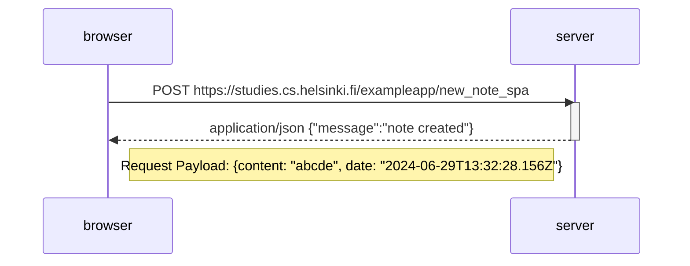

```mermaid
sequenceDiagram
    participant browser
    participant server

    browser->>server: POST https://studies.cs.helsinki.fi/exampleapp/new_note_spa
    activate server
    server-->>browser: application/json {"message":"note created"}
    deactivate server

    Note right of browser: Request Payload: {content: "abcde", date: "2024-06-29T13:32:28.156Z"}
```
